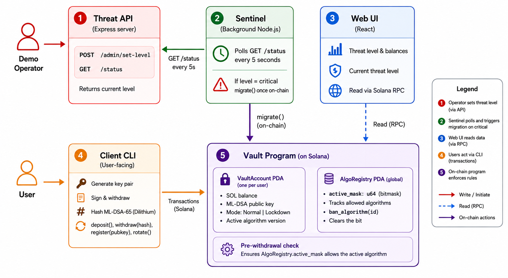

# Quantum Airbag

**Crypto-agile asset protection on Solana** — Quantum × Blockchain Hackathon · Fidelity & Convergence Labs

Quantum Airbag protects user funds against zero-day quantum threats to Ed25519 by moving assets into a program-controlled PDA vault that enforces its own cryptographic policy. A PDA has no private key — there is nothing for a quantum computer to derive. Withdrawal requires a valid ML-DSA (Dilithium) signature. A background sentinel service watches threat feeds and automatically locks the vault when a credible threat is detected.

---

## The Problem

Blockchain systems rely on elliptic curve cryptography (Ed25519 on Solana) which is vulnerable to Shor's algorithm on a sufficiently powerful quantum computer. As quantum computing advances, this creates a need for **crypto-agility** — the ability to rapidly adapt cryptographic systems in response to new threats — without breaking the decentralisation and immutability guarantees that blockchains depend on.

---

## Our Solution

A program-controlled vault on Solana that:
- Holds user funds in a PDA (no private key, nothing for a quantum computer to attack)
- Requires ML-DSA-65 (NIST FIPS 204 / Dilithium) signatures to authorise withdrawals
- Automatically switches to **Lockdown mode** when a quantum threat is detected, blocking Ed25519-only withdrawals
- Supports **crypto-agility** via an on-chain algorithm registry — new algorithms can be added and old ones banned in a single transaction, with instant effect across all vaults

---

## Components

| Directory | What it is |
|-----------|-----------|
| `/program` | On-chain Rust/Anchor vault program |
| `/sentinel` | Off-chain Node.js threat-monitoring service |
| `/client` | CLI tool for PQC key management and vault interactions |
| `/threat-api` | Mock Express threat intelligence API for demo |
| `/ui` | React frontend displaying vault state and threat level |

---

## Architecture



- **Normal mode**: ML-DSA hash commitment required for withdrawal; Ed25519 wallet signs the transaction
- **Lockdown mode**: triggered by sentinel; zero-hash withdrawals blocked at program level; only a valid ML-DSA hash commitment is accepted

---

## Key Design Decisions

| Decision | Rationale |
|---|---|
| PDA vault (no private key) | A quantum computer cannot derive a PDA's key — there is none |
| Off-chain sig + hash commitment | ML-DSA-65 signatures are 3.3 KB; Solana's transaction limit is 1232 bytes |
| Bitmask algorithm registry | One `ban_algorithm` tx instantly blocks an algo across every vault |
| Sentinel scoped to `migrate` only | A compromised sentinel can cause a false lockdown but cannot steal funds |
| `dispatch_pqc_verify` dispatch table | New algorithms are added with a single `match` arm — no vault migration needed |
| ML-DSA-65 (NIST FIPS 204) | Finalised PQC standard; `@noble/post-quantum` provides a pure-JS client implementation |

---

## ⚠ Transaction Size Note

Dilithium3 signatures are 3.3KB. Solana's transaction limit is 1232 bytes. This demo uses off-chain signing with a SHA-256 hash commitment submitted on-chain. The production path is a ZK proof of the Dilithium signature.

---

## Live Demo Sequence

1. Create vault + register ML-DSA key → Mode: NORMAL
2. Deposit 0.5 SOL into PDA vault
3. Normal withdrawal with valid ML-DSA signature → ACCEPTED ✅
4. Flip threat API: `curl -X POST localhost:3000/admin/set-level -d '{"level":"critical"}'`
5. Sentinel fires automatically → Vault: LOCKDOWN 🔒
6. Ed25519-only withdrawal attempted → REJECTED ❌ AlgorithmBanned
7. ML-DSA withdrawal → ACCEPTED ✅ PQC verified

---

## Running Locally

```bash
# 1. Start the mock threat API
cd threat-api && npm install && npm start

# 2. Start the sentinel
cd sentinel && npm install && npm start

# 3. Deploy the vault program (requires Solana CLI + Anchor)
anchor build && anchor deploy

# 4. Run the full demo
cd client && npm install && npm run demo
```
